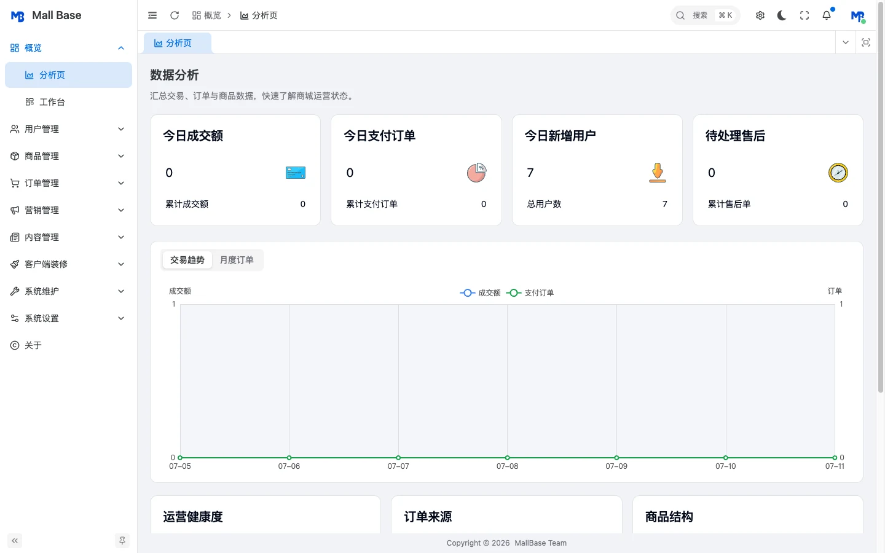
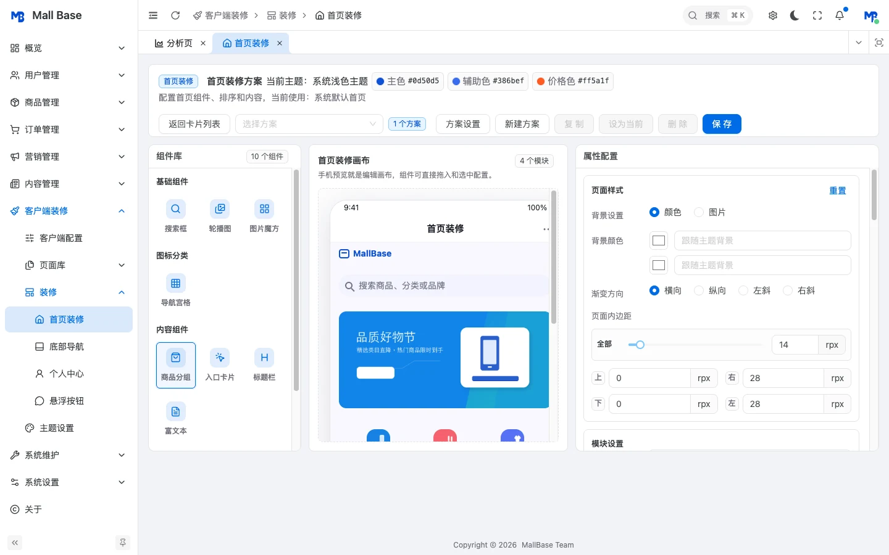
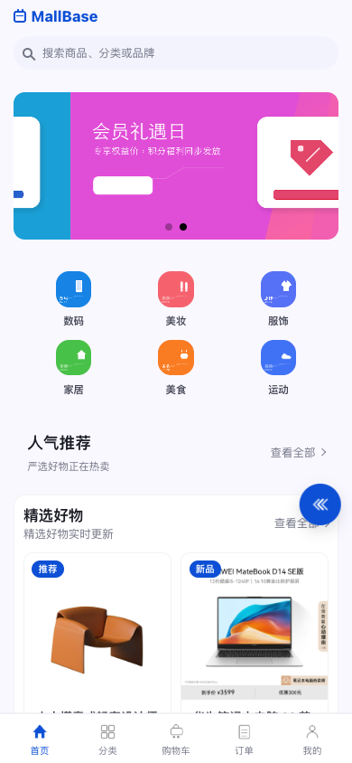
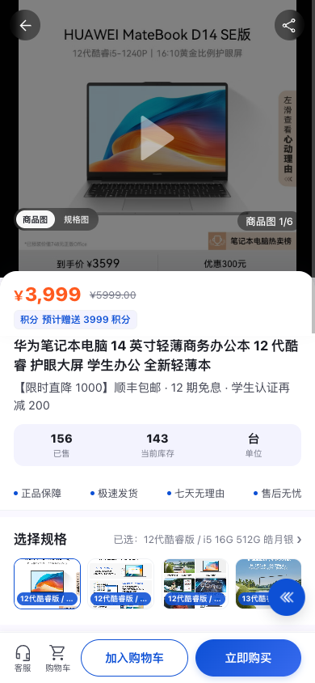

<p align="center">
  
</p>

<h1 align="center">MallBase</h1>

<p align="center">面向二次开发与长期维护的开源商城基础底座</p>

<p align="center">
  <a href="https://platform.gosowong.cn/">官方网站</a> ·
  <a href="https://preview.gosowong.cn/admin">Admin 演示</a> ·
  <a href="https://preview.gosowong.cn/client/#/">H5 演示</a> ·
  <a href="docs/index.md">文档中心</a>
</p>

<p align="center">
  
  
  
  
  
</p>

MallBase 基于 ThinkPHP 8、Swoole、Vben Admin 和 UniApp，覆盖商城后台、客户端与部署基础设施。项目强调清晰分层、稳定边界和可扩展能力，适合作为团队持续演进商城业务的工程基础。

## 产品界面

<table>
  <tr>
    <td width="50%"></td>
    <td width="50%"></td>
  </tr>
  <tr>
    <td align="center">后台管理</td>
    <td align="center">客户端装修</td>
  </tr>
</table>

<table>
  <tr>
    <td width="50%" align="center"></td>
    <td width="50%" align="center"></td>
  </tr>
  <tr>
    <td align="center">客户端首页</td>
    <td align="center">商品详情</td>
  </tr>
</table>

## 核心能力

| 能力 | 说明 |
|------|------|
| 商品与 SKU | 支持商品、分类、品牌、规格与 SKU 的统一管理，并覆盖客户端商品列表、详情与规格选择。 |
| 订单与售后 | 覆盖购物车、下单、支付、订单履约，以及退款、退货和后台售后审核流程。 |
| 会员权益 | 提供会员等级、成长值、积分、余额与分销等可组合的用户权益能力。 |
| 客户端装修 | 支持页面库、首页与个人中心装修、底部导航、悬浮入口和主题配置。 |
| 系统能力 | 提供管理员、角色权限、后端驱动菜单、系统设置和素材管理等后台基础能力。 |
| 部署与扩展 | 提供 Docker Compose 开发环境、Swoole 运行方式，以及扩展槽和存储驱动扩展边界。 |

## 快速开始

```bash
docker compose -f docker-compose.dev.yml up -d
```

打开 `http://localhost:8080/install`，按安装向导完成初始化。需要自定义端口、数据库账号或站点地址时，先复制 `deploy/docker/.example.env` 为根目录 `.env`。

更多安装方式与完整步骤见[安装与部署导航](docs/install/index.md)。

## 技术栈

| 范围 | 技术 |
|------|------|
| 后端 | PHP >= 8.2、ThinkPHP 8、think-swoole、MySQL、Redis |
| Admin | Vben Admin 5.5.9、Vue 3、Vite、Ant Design Vue |
| 客户端 | UniApp、Vue 3、Pinia |
| 部署 | Docker、Docker Compose、Swoole |

## 项目结构

```text
mall-base/
├── backend/                         # ThinkPHP + Swoole 后端
│   └── app/
│       ├── controller/              # Admin、Client、安装与连接器控制器
│       ├── service/                 # 无状态业务服务
│       ├── model/                   # 领域模型
│       ├── validate/                # 请求验证器
│       └── middleware/              # 全局及分端中间件
├── frontend/
│   ├── admin/apps/web-antd/         # Vben Admin 后台
│   └── uniapp/                      # UniApp 客户端
├── deploy/                          # Docker、Nginx 与发布辅助文件
├── docs/                            # 文档中心
├── docker-compose.dev.yml           # 后端 + MySQL + Redis 开发环境
├── docker-compose.yml               # 后端容器部署入口
└── README.md
```

## 文档

| 文档 | 说明 |
|------|------|
| [文档中心](docs/index.md) | 按使用场景浏览项目文档。 |
| [常见问题](docs/faq.md) | 查找常见业务问题与对应文档入口。 |
| [安装与部署](docs/install/index.md) | 选择本地、Docker 或生产环境安装方式。 |
| [操作文档](docs/operation/index.md) | 查看后台配置与业务操作流程。 |
| [业务逻辑](docs/logic/index.md) | 了解核心业务规则与状态流转。 |
| [开发文档](docs/development/index.md) | 查看数据表、接口、服务、扩展点与测试入口。 |
| [变更触发测试矩阵](docs/testing/change-trigger-test-matrix.md) | 根据改动范围选择必要测试。 |
| [Swoole 并发配置指南](docs/testing/swoole-concurrency-config-guide.md) | 查看 worker、连接池与并发参数建议。 |
| [隐私说明](docs/privacy.md) | 了解实例统计的数据范围与关闭方式。 |
| [UniApp 原生客服页接入](docs/development/customer-service-native-page.md) | 了解 H5/微信小程序原生客服会话协议与安全边界。 |

## 交流与反馈

- QQ 群：958717939
- 微信号：yyw1329847115

## 开源协议

本项目基于 [MIT License](LICENSE) 开源。
